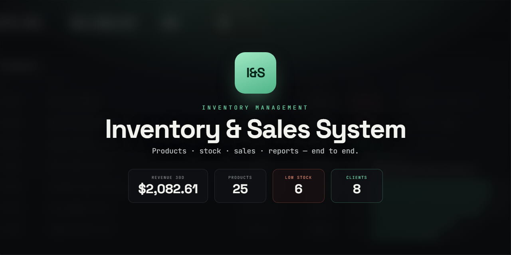

# Inventory Sales



Inventory Sales is a small inventory, sales, and reporting app for teams that need products, stock movements, clients, and sales in one place. It includes a NestJS API, a React web client, PostgreSQL persistence, role-based access, and CSV/PDF reporting.

## Features

- Email/password login with admin, seller, and warehouse roles
- Product, category, supplier, and client management
- Sales creation with stock checks and stock movement history
- Dashboard summaries, stock alerts, and sales/stock reports
- Bilingual web UI in English and Spanish
- Swagger API docs at `/docs`

## Stack

- NestJS 11, Prisma 6, and TypeScript
- PostgreSQL 16
- Vite, React 19, React Router, and TanStack Query
- Docker Compose and nginx for the production-style local stack

## Architecture

```text
inventory-sales/
+-- api/
|   +-- prisma/      schema, migrations, seed data
|   +-- src/         NestJS modules for auth, catalog, stock, sales, reports
+-- web/
|   +-- src/         React routes, pages, auth, API client, shared components
|   +-- nginx.conf   static hosting and API/docs proxy for Docker
+-- docker-compose.yml
```

## Quickstart With Docker

```bash
cp .env.example .env
docker compose up --build
```

The web app is served at `http://localhost:8080`, the API at `http://localhost:3000`, and Swagger at `http://localhost:8080/docs`. The API container runs `prisma migrate deploy` on startup.

Seed demo data when you want it:

```bash
docker compose exec api npx prisma db seed
```

## Local Development

Start PostgreSQL with Compose:

```bash
cp .env.example .env
docker compose up -d postgres
```

Run the API:

```bash
cd api
npm install
npm run dev
```

Run the web app in another terminal:

```bash
cd web
npm install
npm run dev
```

Local API docs are available at `http://localhost:3000/docs`.

## Demo Accounts

| Role | Email | Password |
| --- | --- | --- |
| Admin | `admin@inventory.local` | `demo1234` |
| Seller | `vendedor@inventory.local` | `demo1234` |
| Warehouse | `almacen@inventory.local` | `demo1234` |

## Scripts

API scripts from `api/`:

- `npm run dev` starts the NestJS API in watch mode.
- `npm run build` compiles TypeScript to `dist/`.
- `npm run lint` runs the TypeScript check.
- `npm test` runs the Jest suite.
- `npm run seed` loads demo data through Prisma.

Web scripts from `web/`:

- `npm run dev` starts Vite.
- `npm run build` type-checks and builds the static app.
- `npm run lint` runs the TypeScript check.

## License

MIT. See `LICENSE`.
